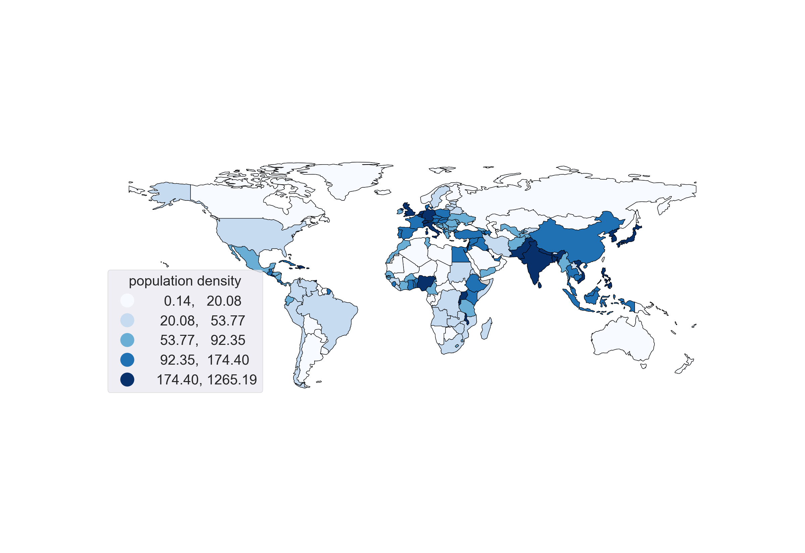

=================================
Plotting Choropleth Map in Python
=================================

Choropleth map color-codes an area with certain data, e.g., `population density <https://upload.wikimedia.org/wikipedia/commons/thumb/1/15/Living_population_density.png/900px-Living_population_density.png>`_. The instructions below provides a step-to-step guide of generating a choropleth in Python (world population density). Note that there are many alternative methods you can explore (e.g., [1]_, [2]_, [3]_ ), but I like ``geopandas`` since it's relatively lightweight and used in similar ways as ``pandas`` and ``matplotlib``.

Steps to generate a choropleth map
----------------------------------

#. Get GeoJSON data (`official site <https://geojson.org/>`_, `Wikipedia <https://en.wikipedia.org/wiki/GeoJSON>`_) for your area of interest. The data included in this repository are from `this site <https://geojson-maps.ash.ms/>`_ put together by Ask Kyd (be sure to check out Ash's `personal site <https://ash.ms/>`_, interesting stuff). For this demo, I selected the entire world. The json data actually contain some information such as population.

#. Get the data you want to show, here I chose the population density from the `World Bank <https://data.worldbank.org/indicator/EN.POP.DNST>`_.

#. Install `geopandas <https://geopandas.org/en/stable/getting_started.html>`_ for plotting (and I assume you already have ``pandas``).

	.. note::

		``geopandas``'s official documentation recommends ``conda`` installation which really messed up my environment, or maybe it's a mess because I had a messed-up environment, anyway, ``pip`` did the magic, if you want to use ``conda``, really consider making a new environment.

#. In your IDE (long live `Spyder <https://www.spyder-ide.org/>`_!), you can import the json data you downloaded with.

	.. code::

		import geopandas as gpd
		world = gpd.read_file('world_map.json')
		world.plot() # see the world map

#. With the data provided in the json file, you can already generate some plot.

	.. code::

		world.plot('economy', legend=False)

#. To update the json data with the data on the population density.

	.. code::

		import pandas as pd
		population = pd.read_csv('population_density.csv', skiprows=4)
		idx1 = world[world.iso_a3.isin(population.loc[:, 'Country Code'])].index
		idx2 = population[population.loc[:, 'Country Code'].isin(world.iso_a3)].index
		world.loc[idx1, 'population_2020'] = population.loc[idx2, '2020']

#. And now we can get the plot.

	.. code::
		
		# Just to make it nicer
		from matplotlib import pyplot as plt
		plt.style.use('seaborn')

		missing_kwds = dict(color='lightgrey', label='No Data')
		ax = world.plot('population_2020', cmap='cool', edgecolor='k', legend=True,
		                missing_kwds=missing_kwds)
		ax.figure.show()

#. Here's what I got, it certainly can be polished up, but the rest is just wrestling with ``matplotlib``, have fun!

References
----------
.. [1] https://medium.com/geekculture/three-ways-to-plot-choropleth-map-using-python-f53799a3e623
.. [2] https://swdevnotes.com/python/2020/display-world-map-country-data/
.. [3] https://towardsdatascience.com/a-beginners-guide-to-create-a-cloropleth-map-in-python-using-geopandas-and-matplotlib-9cc4175ab630